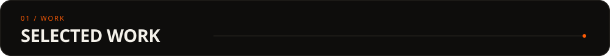
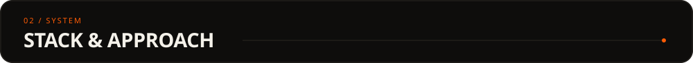
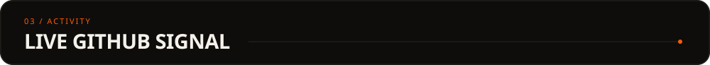
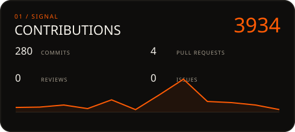
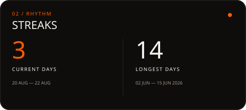
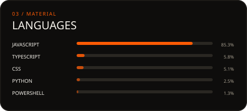
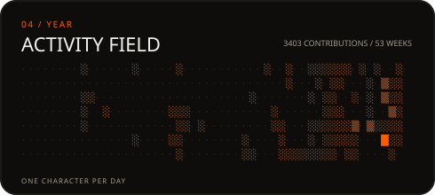

<!-- profile-readyy -->

<picture>
  <source media="(max-width: 600px)" srcset="./assets/portrait-mobile.svg" />
  
</picture>

  <a href="https://structiva.at/"><samp>STRUCTIVA ↗</samp></a>
  &nbsp;·&nbsp;
  <a href="https://structiva.at/portfolio/"><samp>SHOWROOM ↗</samp></a>
  &nbsp;·&nbsp;
  <a href="https://www.linkedin.com/in/raphael-wagner-740a53385/"><samp>LINKEDIN ↗</samp></a>

> Ich entwickle Websites, Systeme und Automationen, die **maßgeschneidert statt zusammengebaut** wirken. 
> Bei [Structiva](https://structiva.at/) verbinde ich Design, Entwicklung, SEO und technische Betreuung zu einem durchgängigen System.

### [Structiva](https://structiva.at/) — Websites, die mitarbeiten

<samp>WEBDESIGN · DEVELOPMENT · SEO · HOSTING · AUTOMATION</samp>

Konzeption, Entwicklung und langfristige Betreuung individueller Websites für Unternehmen in Österreich — mit klarer Strategie, eigenständiger Gestaltung und einem belastbaren technischen Fundament.

### [Structiva Showroom](https://structiva.at/portfolio/) — Branchenkonzepte zum Erleben

<samp>CREATIVE DIRECTION · UI SYSTEMS · RESPONSIVE IMPLEMENTATION</samp>

Interaktive Website-Konzepte für unterschiedliche Branchen. Kein Screenshot-Archiv, sondern live klickbare Systeme mit eigener visueller Sprache.

### Open-source tools

- [`frontend-design-ultra`](https://github.com/ov3rf1w/frontend-design-ultra) — ein Design-Operating-System für hochwertige Frontend-Arbeit
- [`ui-responsive-audit`](https://github.com/ov3rf1w/ui-responsive-audit) — Playwright-basierte QA über Desktop, Tablet und Mobile

  <samp>PYTHON · TYPESCRIPT · JAVASCRIPT · REACT · NEXT.JS · ASTRO · TAILWIND CSS · PLAYWRIGHT · GITHUB ACTIONS · LINUX</samp>

Ich arbeite am liebsten an der Schnittstelle von visueller Qualität und technischer Substanz: Designsysteme, responsive Interfaces, Automatisierung, Performance, SEO und produktionsreife Workflows.

  
  

  
  

  <samp>GENERATED IN THIS REPOSITORY · UPDATED BY GITHUB ACTIONS · ZERO THIRD-PARTY WIDGETS</samp>

